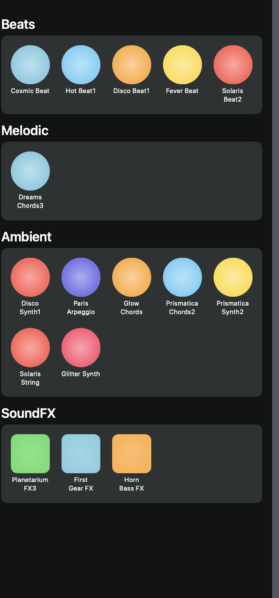

# Soundboard
# 🎵 SoundPadView - Interactive Music Pad in SwiftUI

SoundPadView is a fun, customizable music pad interface built using **SwiftUI**. It provides users with the ability to play loops, melodies, ambient layers, and sound effects using a tactile button interface.

---

## 📸 Screenshot

<!-- Replace the below line with an actual image file in your repo, e.g., "Assets/screenshot.png" -->


---

## ✨ Features

- 🎧 **Beats Section**: Tap into pre-made rhythmic loops like `CosmicBeat`, `HotBeat1`, and `DiscoBeat1`.
- 🎹 **Melodic Section**: Layer in dreamy chords and arpeggios.
- 🌌 **Ambient Section**: Explore lush synths and ambient textures.
- 🚀 **Sound FX Section**: Add dynamic sound effects like `PlanetariumFX3` and `HornBassFX`.

Each button is color-coded for easy navigation and feedback.

---

## 🛠 Setup Instructions

1. Clone this repo:
    ```bash
    git clone https://github.com/your-username/soundpadview.git
    ```

2. Open the project in **Xcode** (requires Xcode 13 or later).

3. Run the project on an iOS Simulator or physical device.

---

## 📁 Project Structure

```swift
SoundPadView.swift         // Main view containing all loop categories
LoopButton.swift           // Custom button for triggering beats, melodies, ambient sounds
SoundFXButton.swift        // Custom button for triggering sound effects
